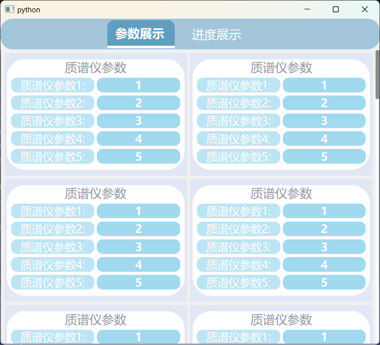
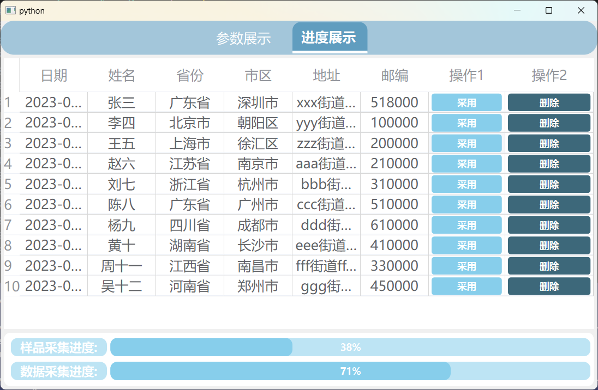

# Mass-Spctrometer-Software

## 正在开发中, 打算在八月底完成所有 UI 界面

### 目前已完成的页面
1. 主界面导航栏, 动态收缩变换, 软件开发者信息栏
2. 动态加载控件的 demo
3. homePage 页
### 1. 主界面和开发者信息栏


-   右上角的按钮可以用于切换皮肤, 准备做两套明暗的皮肤, 目前还未完成, 因此点击按钮不会有任何效果.

### 2. 动态加载控件 demo


采用了懒加载和防抖函数避免重新加载界面时出现的卡顿现象, 上面的例子中加载了 $6000$ 个带按钮的 $\text{frame}$。每次只加载 $50$ 行, 滚动条到尾部会自动更新 $50$ 条直到所有的控件加载完毕。这个例子同样适用于在 $\text{QTabelWidget}$ 的数据更新。

需要注意的点如下:
1. 更新时检测能容下 $\text{frame}$ 的 $\text{column}$ 数量大小是否发生变化, 避免无意义的重排
2. 更新 $\text{gridLayout}$ 时, 删除原有布局中控件的正确做法
-   ```python    
    def clearWidgets(self):
        # Clear all widgets from the grid layout
        while self.gridLayout.count():
            widget = self.gridLayout.itemAt(0).widget()
            if widget:
                self.gridLayout.removeWidget(widget)
                widget.setParent(None)  # type: ignore  
                # must set the parent of widget to be None; Otherwise, the widgets are cascaded on the interface
3. 使用防抖函数, 定时器使用 $\text{QTimer}$, 使用线程中的 $\text{timer}$ 会有问题。这里我设定的 $\text{timeout}$ 时间为 200 ms; 这是一个常用的技巧, 当我们在短时间内执行大量的操作时, 我们需要多次更新某个东西时, 我们可以让他只执行最后一次的更新操作, 也就是说在 200 ms 内如果我执行了 10 次操作, 我只需要让他最后一次执行就行, 前面 9 次的操作直接忽略。下面是一个常用的 demo 代码
```python
class Debounce:
    def __init__(self, func: Callable, delay: int):
        '''
        Parameters:
        * func: the function
        * delay: the delay of the timer
        '''
        self.func = func
        self.delay = delay
        self.timer = None

    def __call__(self):
        print("Debounce called")
        if self.timer is not None:
            print("Stopping previous timer")
            self.timer.stop()
            self.timer.deleteLater()
            self.timer = None
        self.timer = QTimer()
        self.timer.timeout.connect(self.func)
        self.timer.start(self.delay)
```
> 实现的细节可见 `lazyLoadDebounceUpdateDemo.py` 文件

### 3. homePage 页
该页面准备展示设定好的质谱仪以及液相仪的参数和数据采集/图片绘制的进度
#### 3.1 参数展示



-   参数展示部分可能由最终的仪器决定. 

#### 3.2 进度展示


-   表格中的数据目前待定, 根据后续的需求需要更改, 目前只放了测试数据


### 4. 后续安排

按照一天一个页面的进度的话, 预计在 8 月 26 日完成所有页面的设计, 但是因为目前质谱仪硬件接口以及数据交互 $\text{(可以选择本地的数据库使用 sqlite, python自带 sqlite3 库; }$$\text{也可以使用远程数据库连接, 不过需要再实现后端代码实现高并发}$
$\text{仓库中有个高并发的 go 语言后端代码示例, 可以处理多个请求, 可以参考一下, 实验室服务器需要装下 mysql 还有go 语言的环境)}$的方式未确定, 因此软件页面设计以及窗口完成之后需要花很多的时间研究硬件的接口, 该软件的主要难点也在于此, 还有就是打包的问题, 可以使用 nuikta 库打包文件, 详情参见博客 https://blog.rainzee.wang/postsnuitka-plugin-system.html


