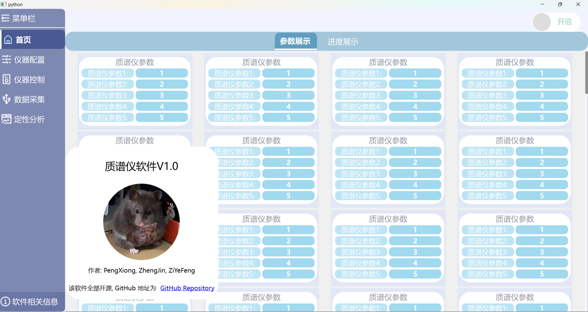

# Mass-Spctrometer-Software

## 正在开发中, 打算在八月底完成所有 UI 界面

### 目前已完成的页面
1. 主界面导航栏, 动态伸缩变换
2. 软件开发者信息栏
3. 动态加载控件 demo

### 1. 主界面和开发者信息栏

### 2. 动态加载控件 demo

采用了懒加载和防抖函数避免重新加载界面时出现的卡顿现象, 上面的例子中加载了 $6000$ 个带按钮的 $\text{frame}$。每次只加载 $50$ 行, 滚动条到尾部会自动更新 $50$ 条直到所有的控件加载完毕。这个例子同样适用于在 $\text{QTabelWidget}$ 的数据更新。
